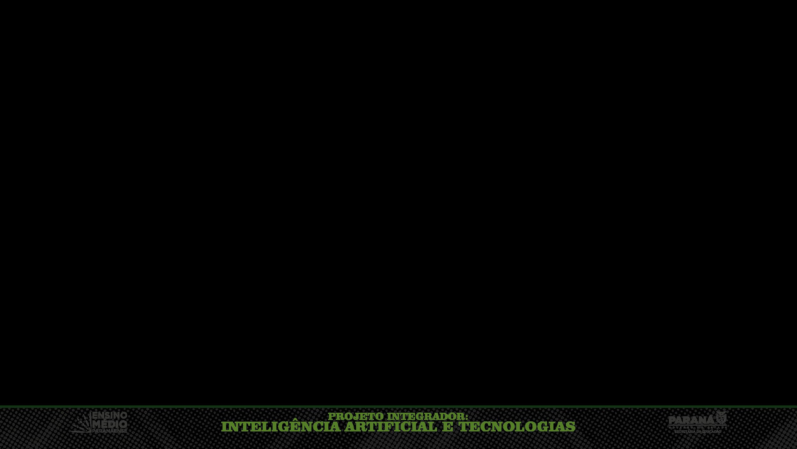

# RECOMENDAÇÕES DE IMAGENS PARA O SITE SOBRE BENGALA INTELIGENTE

## Resumo da Extração

**Total de imagens extraídas dos 3 PDFs:** 383 imagens
**Imagens selecionadas como relevantes:** 108 imagens
**Local das imagens:** `images/pdf_extracted/`

## Categorias de Imagens

### 1. Diagramas Widescreen (77 imagens)
- **Formato:** Proporção 16:9 (aspect ratio ~1.77)
- **Dimensões típicas:** 2500x1410px, 1920x1080px, 2048x1365px
- **Uso recomendado:** Seções Fisiologia do Olho, Física & Limites, e Bengala Inteligente
- **Ideais para:** Diagramas de anatomia ocular, esquemas de circuitos, ilustrações de funcionamento

### 2. Ícones Quadrados (27 imagens)
- **Formato:** Proporção 1:1 (aspect ratio ~1.00)
- **Dimensões típicas:** 640x640px, 1024x1024px, 390x390px
- **Uso recomendado:** Ícones de componentes, galeria de imagens, ilustrações
- **Ideais para:** Ícones dos componentes da bengala, ilustrações dos problemas de visão

### 3. Formato Standard (4 imagens)
- **Formato:** Proporção variada entre 1.3 e 1.5
- **Uso recomendado:** Cards informativos, seções gerais

## Recomendações Específicas por Seção do Site

### 📍 Seção HERO (Topo)
**Status:** Já possui modelo 3D da bengala
**Sugestão:** Não é necessário adicionar imagens dos PDFs aqui

---

### 📍 Seção FISIOLOGIA DO OLHO (#fisiologia)
**Local no HTML:** Linhas 106-208

**Imagens recomendadas:**
1. **Diagramas de anatomia ocular** (usar imagens widescreen de alta qualidade)
   - Exemplo: `2_6558___2a_SERIE_AULA_22_2026_page_1_img_1.jpeg` (2500x1410px, 146.4KB)
   - Exemplo: `2_6558___2a_SERIE_AULA_23_2026_page_1_img_1.jpeg` (2500x1410px, 146.4KB)
   
2. **Ícones para cada componente** (usar imagens quadradas)
   - Para Córnea: `2_6558___2a_SERIE_AULA_22_2026_page_10_img_6.jpeg` (640x640px)
   - Para Cristalino: `2_6558___2a_SERIE_AULA_22_2026_page_11_img_9.jpeg` (1024x1024px)
   - Para Retina: `2_6558___2a_SERIE_AULA_22_2026_page_12_img_8.jpeg` (450x450px)

**Implementação sugerida:**
```html
<!-- Adicionar após o grid de cards -->
<div class="physiology-diagram reveal">
  
  <p class="diagram-caption">Diagrama detalhado das estruturas do olho humano</p>
</div>
```

---

### 📍 Seção PROBLEMAS DE VISÃO (#problemas)
**Local no HTML:** Linhas 212-286

**Imagens recomendadas:**
1. **Diagramas de Miopia, Hipermetropia e Astigmatismo**
   - Exemplo: `2_6558___2a_SERIE_AULA_22_2026_page_13_img_6.jpeg` (1200x675px, 74.3KB)
   - Exemplo: `2_6558___2a_SERIE_AULA_23_2026_page_13_img_5.jpeg` (1200x675px, 74.3KB)

2. **Ilustrações comparativas**
   - Exemplo: `2_6558___2a_SERIE_AULA_22_2026_page_13_img_5.jpeg` (1162x298px, 66.1KB)

**Implementação sugerida:**
```html
<!-- Adicionar após o grid de cards -->
<div class="vision-problems-diagram reveal">
  
  <p class="diagram-caption">Comparação visual dos principais erros de refração</p>
</div>
```

---

### 📍 Seção FÍSICA & LIMITES (#fisica)
**Local no HTML:** Linhas 290-376

**Imagens recomendadas:**
1. **Espectro eletromagnético**
   - Exemplo: `2_6558___2a_SERIE_AULA_22_2026_page_1_img_6.jpeg` (2048x374px, 82.4KB)
   - Exemplo: `2_6558___2a_SERIE_AULA_23_2026_page_1_img_5.jpeg` (2048x374px, 82.4KB)

2. **Diagramas de ponto cego**
   - Exemplo: `2_6558___2a_SERIE_AULA_22_2026_page_12_img_6.jpeg` (2048x1365px, 128.1KB)

**Implementação sugerida:**
```html
<!-- Adicionar após o experimento interativo -->
<div class="physics-diagram reveal">
  
  <p class="diagram-caption">Espectro eletromagnético e faixa visível humana</p>
</div>
```

---

### 📍 Seção BENGALA INTELIGENTE (#bengala)
**Local no HTML:** Linhas 380-463

**Status:** Já possui um esquema de montagem
**Imagens recomendadas:**
1. **Esquemas de circuito adicionais**
   - Exemplo: `2_6558___2a_SERIE_AULA_22_2026_page_2_img_6.jpeg` (2500x1410px, 684.7KB - ALTA QUALIDADE)
   - Exemplo: `2_6558___2a_SERIE_AULA_23_2026_page_2_img_5.jpeg` (2500x1410px, 684.7KB - ALTA QUALIDADE)
   - Exemplo: `2_6558___2a_SERIE_AULA_23_2026_page_4_img_7.jpeg` (2048x1365px, 335.7KB - ALTA QUALIDADE)

2. **Diagramas de funcionamento do sensor**
   - Exemplo: `2_6558___2a_SERIE_AULA_22_2026_page_5_img_6.jpeg` (1184x896px, 118.0KB)

**Implementação sugerida:**
```html
<!-- Adicionar após a lista de componentes -->
<div class="circuit-diagram reveal">
  
  <p class="diagram-caption">Diagrama esquemático completo do circuito da bengala</p>
</div>
```

---

### 📍 Seção GALERIA (#galeria)
**Local no HTML:** Linhas 557-604

**Status:** Possui 3 placeholders para upload
**Imagens recomendadas:**
1. **Para "Esquema do Circuito":**
   - `2_6558___2a_SERIE_AULA_22_2026_page_2_img_6.jpeg` (circuito detalhado)

2. **Para "Infográfico: Anatomia & Fisiologia do Olho":**
   - `2_6558___2a_SERIE_AULA_22_2026_page_1_img_1.jpeg` (anatomia ocular)

3. **Para "Testes do 2° Ano com Vendas":**
   - Se houver fotos de laboratório nos PDFs, usar imagens quadradas de alta qualidade
   - Exemplo: `2_6558___2a_SERIE_AULA_22_2026_page_8_img_16.jpeg` (2000x1498px, 71.0KB)

**Implementação sugerida:**
```html
<!-- Substituir os placeholders existentes -->
<div class="gallery-item reveal">
  
  <p class="gallery-caption">Esquema do Circuito (Arduino + HC-SR04)</p>
</div>
```

---

## Estilos CSS Sugeridos

Adicionar ao arquivo `styles/styles.css`:

```css
/* Diagramas e Imagens Extraídas */
.diagram-img {
  width: 100%;
  max-width: 800px;
  height: auto;
  border-radius: 12px;
  box-shadow: 0 4px 20px rgba(0, 0, 0, 0.1);
  margin: 20px auto;
  display: block;
}

.diagram-caption {
  text-align: center;
  color: var(--text-muted);
  font-size: 0.9rem;
  margin-top: 10px;
  font-style: italic;
}

.physiology-diagram,
.vision-problems-diagram,
.physics-diagram,
.circuit-diagram {
  background: var(--card-bg);
  padding: 30px;
  border-radius: 16px;
  margin: 30px 0;
  text-align: center;
}

.gallery-img {
  width: 100%;
  height: 300px;
  object-fit: cover;
  border-radius: 12px;
  transition: transform 0.3s ease;
}

.gallery-img:hover {
  transform: scale(1.05);
}

.gallery-caption {
  text-align: center;
  margin-top: 10px;
  font-weight: 600;
  color: var(--text-primary);
}
```

---

## Próximos Passos Sugeridos

1. **Revisão Manual:** Visualizar as 108 imagens na pasta `images/pdf_extracted/` para identificar quais contêm conteúdo realmente relevante para o projeto

2. **Seleção Fina:** Escolher 5-10 imagens de maior qualidade e relevância para uso imediato

3. **Otimização:** Considerar compressão das imagens para melhor performance do site (usar ferramentas como TinyPNG ou ImageOptim)

4. **Nomenclatura:** Renomear as imagens selecionadas com nomes mais descritivos (ex: `anatomia_olho_01.jpg` em vez de `2_6558___2a_SERIE_AULA_22_2026_page_1_img_1.jpeg`)

5. **Implementação:** Adicionar as imagens selecionadas ao HTML seguindo as sugestões acima

---

## Arquivos Gerados

1. **`images/pdf_extracted/`** - Pasta com 108 imagens selecionadas
2. **`images/pdf_extracted/image_catalog.json`** - Catálogo JSON com metadados de todas as imagens
3. **`images/pdf_extracted/RELATORIO_IMAGENS.md`** - Relatório detalhado das imagens
4. **`courses/extracted_images/`** - Pasta com todas as 383 imagens extraídas originalmente
5. **`courses/candidate_images/`** - Pasta com 195 imagens candidatas (filtro intermediário)
6. **`courses/candidate_images/selecao_relatorio.txt`** - Relatório do processo de seleção

---

## Notas Importantes

- As imagens foram extraídas automaticamente usando PyMuPDF
- A seleção foi baseada em critérios de tamanho, proporção e qualidade
- **Revisão manual é necessária** para confirmar o conteúdo de cada imagem
- Algumas imagens podem ser duplicadas (mesmo conteúdo em páginas diferentes)
- Priorize imagens de alta qualidade (>100KB) para uso no site
- Considere a acessibilidade: adicionar `alt` text descritivo para todas as imagens
